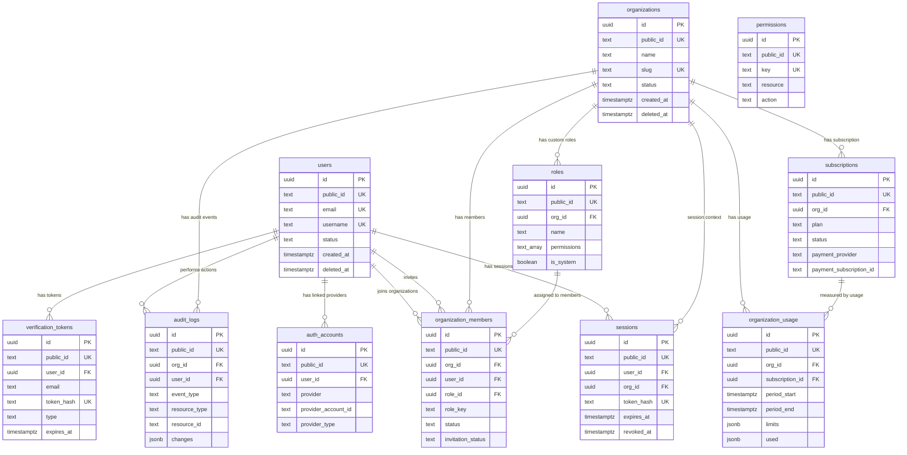

# BusinessSAAS Database Documentation

Generated from migration files on 2026-05-19. Updated for migration 00013 on 2026-06-14.

This documentation describes the current Phase 1 SaaS foundation schema: identity, organizations, RBAC, membership, authentication/session security, billing/subscription state, usage metering, and audit logging.

## Documentation map

- `erd.md` — entity relationship diagram and parent/child flow.
- `data-dictionary.md` — combined column dictionary for every table.
- `relationships.md` — foreign key and deletion behavior.
- `rbac-permissions.md` — RBAC design, permission keys, seeded roles, and authorization rules.
- `auth-security.md` — authentication/session/token storage notes.
- `billing-subscription.md` — subscription and usage model.
- `audit-logging.md` — audit trail design and event examples.
- `data-classification.md` — sensitivity classification and storage rules.
- `migration-policy.md` — rules for future database changes.
- `tables/*.md` — one page per table.
- `dbml/schema.dbml` — DBML representation for ERD tools.

## Core design principles

1. Use UUID internal primary keys for database relations.
2. Use prefixed `public_id` values for API-facing identifiers.
3. Keep user identity separate from organization membership.
4. Keep authorization permission-based, not only role-name-based.
5. Store raw passwords, refresh tokens, session tokens, and verification tokens nowhere.
6. Treat OAuth tokens, 2FA secrets, and backup codes as critical secrets.
7. Track important business/security actions in `audit_logs`.
8. Update these docs in the same pull request as every migration.

## Current table domains

| Domain | Tables |
| --- | --- |
| Core Identity | `users`, `auth_accounts`, `sessions`, `verification_tokens` |
| Tenant / Workspace | `organizations`, `organization_members` |
| Authorization / RBAC | `permissions`, `roles` |
| Billing / SaaS | `subscriptions`, `organization_usage` |
| Security / Compliance | `audit_logs` |
| Task Management | `tasks` |

## SaaS-grade documentation rule

A migration is not complete until the following are updated:

- PostgreSQL `COMMENT ON TABLE` / `COMMENT ON COLUMN` statements.
- Table page under `docs/database/tables/`.
- `data-dictionary.md` if a column changed.
- `relationships.md` and `erd.md` if a relationship changed.
- `data-classification.md` if sensitive fields were added or changed.
- API documentation if request/response behavior changed.


---

# Entity Relationship Diagram

## High-level relationship flow

```text
users
  ├── auth_accounts
  ├── sessions
  ├── verification_tokens
  ├── organization_members
  └── audit_logs

organizations
  ├── organization_members
  ├── roles
  ├── sessions
  ├── subscriptions
  ├── organization_usage
  └── audit_logs

roles
  └── organization_members

subscriptions
  └── organization_usage
```

## Mermaid ERD



## Important modeling notes

`permissions` does not currently have a physical many-to-many join table with `roles`. The `roles.permissions` field stores permission keys as `TEXT[]`. This is acceptable for an early SaaS phase because it keeps RBAC simple, but the application must validate all role permission keys against `permissions.key`.

For a larger enterprise-grade version, add a normalized `role_permissions` table.


---

# Database Relationships

This document explains how records connect and how deletion behavior should be interpreted by the application.

## Relationship summary

| Table | Relationship notes |
| --- | --- |
| users | Parent of auth_accounts through auth_accounts.user_id. |
| users | Parent of sessions through sessions.user_id. |
| users | Parent of verification_tokens through verification_tokens.user_id. |
| users | Parent of organization_members through organization_members.user_id. |
| users | Referenced by audit_logs.user_id and organization_members.invited_by. |
| organizations | Parent of organization_members, roles, sessions, subscriptions, organization_usage, and audit_logs. |
| permissions | No FK from roles.permissions because roles stores permission keys as TEXT[]. Application must validate these keys against permissions.key. |
| roles | May belong to organizations through roles.org_id. |
| roles | Referenced by organization_members.role_id. |
| organization_members | Belongs to organizations. |
| organization_members | Belongs to users. |
| organization_members | Optionally belongs to roles. |
| organization_members | invited_by references users. |
| auth_accounts | Belongs to users through user_id. |
| sessions | Belongs to users. |
| sessions | Optionally belongs to organizations. |
| verification_tokens | Optionally belongs to users. |
| subscriptions | Belongs to organizations. |
| subscriptions | Parent/optional reference for organization_usage. |
| organization_usage | Belongs to organizations. |
| organization_usage | Optionally belongs to subscriptions. |
| audit_logs | Optionally belongs to organizations. |
| audit_logs | Optionally belongs to users. |

## Foreign key deletion behavior

| Child table | Foreign key | Parent table | Delete behavior | Business meaning |
| --- | --- | --- | --- | --- |
| auth_accounts | user_id | users | ON DELETE CASCADE | If a user is physically removed, linked provider accounts are removed. |
| sessions | user_id | users | ON DELETE CASCADE | If a user is physically removed, sessions are removed. |
| sessions | org_id | organizations | ON DELETE CASCADE | Organization-scoped sessions are removed if organization is physically removed. |
| verification_tokens | user_id | users | ON DELETE CASCADE | User-bound verification/recovery tokens are removed. |
| roles | org_id | organizations | ON DELETE CASCADE | Tenant-specific roles are removed with the tenant. |
| organization_members | org_id | organizations | ON DELETE CASCADE | Memberships are removed if organization is removed. |
| organization_members | user_id | users | ON DELETE CASCADE | Memberships are removed if user is removed. |
| organization_members | role_id | roles | ON DELETE SET NULL | Membership survives if assigned role is removed; role_key remains as fallback. |
| organization_members | invited_by | users | ON DELETE SET NULL | Invitation record survives if inviter is removed. |
| subscriptions | org_id | organizations | ON DELETE CASCADE | Subscription belongs to organization. |
| organization_usage | org_id | organizations | ON DELETE CASCADE | Usage belongs to organization. |
| organization_usage | subscription_id | subscriptions | ON DELETE SET NULL | Usage history can remain even if subscription reference is removed. |
| audit_logs | org_id | organizations | ON DELETE CASCADE | Current schema removes tenant audit logs if organization is physically deleted. |
| audit_logs | user_id | users | ON DELETE SET NULL | Audit event remains even if actor user is removed. |

## Recommended SaaS policy

Prefer soft delete for `users` and `organizations`. Physical deletion should be rare and controlled because many child records cascade. For compliance or privacy deletion, create a formal deletion/anonymization procedure instead of casually deleting parent rows.


---

# Data Classification

This document classifies database tables by business and security sensitivity.

| Table | Sensitivity | Why | Required controls |
| --- | --- | --- | --- |
| users | High | Contains identity, contact, profile, 2FA, lockout, and preference data. | Never store raw passwords. Encrypt 2FA secrets and backup codes. |
| organizations | Medium | Contains business identity/workspace data. | Legal name and metadata may be sensitive. |
| permissions | Low/Operational | Authorization vocabulary. | Should be controlled by migration/seed process. |
| roles | High | Controls access to resources. | Role changes affect authorization and must be audited. |
| organization_members | High | Connects users to tenants and access levels. | Membership/role changes must be audited. |
| auth_accounts | Critical | Can contain OAuth/OIDC tokens. | Encrypt tokens. Minimize scopes. Rotate where possible. |
| sessions | High/Critical | Contains token hashes, IP, device, location data. | Never store raw tokens. Set expiry and cleanup. |
| verification_tokens | Critical | Contains one-time token hashes and email addresses. | Never store raw tokens. Enforce expiry and single-use. |
| subscriptions | High | Billing state and external customer/subscription ids. | Protect payment provider identifiers. |
| organization_usage | Medium | Usage counters and plan limits. | Useful for billing enforcement; keep accurate. |
| audit_logs | High | Security/business event trail with IP/user agent/changes. | Avoid secrets in metadata/changes. Define retention policy. |

## Critical controls

- Passwords: store only strong password hashes.
- OAuth tokens: encrypt at application/storage layer before production.
- Session and verification tokens: store only hashes, never raw tokens.
- 2FA secrets and backup codes: encrypt or hash depending on flow requirements.
- Audit logs: do not write passwords, raw tokens, full authorization headers, or unnecessary secrets into `changes` or `metadata`.
- PII fields: restrict access through RBAC and API-level checks.


---

# RBAC and Permission Documentation

## RBAC model

The current model uses permission keys as the real authorization unit. Roles are collections of permission keys. Members receive access through `organization_members.role_id`, `organization_members.role_key`, and optional `organization_members.custom_permissions`.

## Permission key format

```text
resource.action
```

Example:

```text
billing.manage
members.invite
projects.update
```

## Seeded permissions

| Permission key | Resource | Action |
| --- | --- | --- |
| dashboard.view | dashboard | view |
| organization.view | organization | view |
| organization.update | organization | update |
| members.view | members | view |
| members.invite | members | invite |
| members.update | members | update |
| members.remove | members | remove |
| roles.view | roles | view |
| roles.assign | roles | assign |
| billing.view | billing | view |
| billing.manage | billing | manage |
| subscription.view | subscription | view |
| subscription.update | subscription | update |
| projects.view | projects | view |
| projects.create | projects | create |
| projects.update | projects | update |
| projects.delete | projects | delete |
| settings.view | settings | view |
| settings.update | settings | update |
| audit_logs.view | audit_logs | view |
| api_keys.view | api_keys | view |
| api_keys.create | api_keys | create |
| api_keys.revoke | api_keys | revoke |

## Seeded system roles

| Role | Business meaning |
| --- | --- |
| owner | Full organization owner with all permissions. Includes billing.manage, members.remove, roles.assign, audit_logs.view, and API key controls. |
| admin | Broad management access but slightly less powerful than owner. Current seed does not include members.remove or billing.manage. |
| manager | Project and member visibility with project create/update but no billing or role management. |
| member | Regular organization member with dashboard, organization view, project create/update, and settings view/update. |
| viewer | Read-only organization viewer with dashboard, organization, members, projects, and settings view. |

## Effective permission calculation

Recommended application rule:

```text
effective_permissions = role.permissions + organization_members.custom_permissions
```

Then check whether the requested permission exists in the effective permission set.

## Authorization examples

| Action | Required permission |
| --- | --- |
| View dashboard | dashboard.view |
| Invite a member | members.invite |
| Change member role | members.update and roles.assign |
| Remove a member | members.remove |
| View billing | billing.view |
| Change subscription | billing.manage or subscription.update |
| View audit logs | audit_logs.view |
| Create project | projects.create |
| Delete project | projects.delete |

## Important SaaS-grade notes

- Do not authorize only by `role_key`. Use permission keys.
- Do not trust frontend permission checks. Backend must enforce permission checks.
- Permission changes should create `audit_logs` records.
- Role deletion should not break sessions; `role_key` gives fallback context, but backend should refresh permissions from database.
- For larger systems, replace `roles.permissions TEXT[]` with a normalized `role_permissions` join table.


---

# Authentication and Security Documentation

## Related tables

- `users` — core user account, profile, security state, 2FA fields.
- `auth_accounts` — linked provider identities and OAuth/OIDC tokens.
- `sessions` — active/historical sessions and refresh-token tracking.
- `verification_tokens` — email verification, password reset, magic link, invitation, and 2FA one-time tokens.
- `audit_logs` — records important auth/security actions.

## SaaS-grade storage rules

| Data | Storage rule |
|---|---|
| Password | Store only password hash. Never plaintext. |
| Session token / refresh token | Store only `token_hash`. Never raw token. |
| Verification token | Store only `token_hash`. Never raw token. |
| OAuth access token | Encrypt before production use. |
| OAuth refresh token | Encrypt before production use. |
| OIDC id token | Encrypt or avoid storing unless required. |
| 2FA secret | Encrypt at rest. |
| Backup codes | Store hashed/encrypted; never plaintext after generation. |

## Recommended auth events for audit_logs

| Event type | When to log |
|---|---|
| `auth.sign_up` | User account created. |
| `auth.sign_in` | Successful login. |
| `auth.sign_in_failed` | Failed login attempt. |
| `auth.logout` | User logs out. |
| `auth.session_revoked` | User/admin revokes a session. |
| `auth.password_reset_requested` | Password reset requested. |
| `auth.password_reset_completed` | Password reset completed. |
| `auth.email_verified` | Email verification completed. |
| `auth.2fa_enabled` | 2FA enabled. |
| `auth.2fa_disabled` | 2FA disabled. |
| `auth.provider_linked` | OAuth provider linked. |
| `auth.provider_unlinked` | OAuth provider removed. |

## Session lifecycle

1. User signs in.
2. App generates raw refresh/session token.
3. App stores only token hash in `sessions.token_hash`.
4. Raw token is returned to the client through secure cookie or equivalent secure channel.
5. On refresh, app hashes presented token and compares with stored hash.
6. On logout/revocation, app sets `revoked_at`.
7. Expired sessions are removed or archived by scheduled cleanup.

## Production checklist

- Use HTTPS-only secure cookies in production.
- Use HttpOnly cookies for refresh tokens.
- Rotate JWT signing secrets carefully.
- Rate-limit login, password reset, magic link, and verification endpoints.
- Lock accounts temporarily using `failed_logins` and `locked_until`.
- Encrypt OAuth and 2FA secrets.
- Log security events to `audit_logs`.


---

# Billing and Subscription Documentation

## Related tables

- `subscriptions` — current organization subscription and payment provider mapping.
- `organization_usage` — plan limits and actual usage by billing period.
- `organizations` — owner of subscription and usage records.
- `audit_logs` — records subscription and billing changes.

## Business model

The current schema follows a B2B SaaS model where billing belongs to the organization/workspace, not directly to a single user.

That means:

- One organization can have one or more subscription records over time.
- One subscription can cover many organization members.
- Feature access should be calculated from subscription plan/status plus organization usage.

## Subscription fields that control access

| Field | Meaning |
|---|---|
| `plan` | Machine-readable plan level: free, pro, business, enterprise. |
| `status` | Billing state: trialing, active, past_due, cancelled, expired. |
| `billing_cycle` | monthly, yearly, or lifetime. |
| `current_period_end` | Used to know when the current billing period ends. |
| `cancel_at_period_end` | Indicates scheduled cancellation. |
| `payment_provider` | External payment platform name. |
| `payment_customer_id` | External customer identifier. |
| `payment_subscription_id` | External subscription identifier. |

## Usage model

`organization_usage.limits` and `organization_usage.used` are JSONB because this is flexible for early SaaS development.

Example:

```json
{
  "limits": {
    "members": 10,
    "projects": 25,
    "storageGB": 20,
    "apiRequestsPerMonth": 100000
  },
  "used": {
    "members": 7,
    "projects": 12,
    "storageGB": 4.2,
    "apiRequestsPerMonth": 18420
  }
}
```

## Access decision example

```text
Can create project?
1. Check user has projects.create permission.
2. Check organization subscription status is trialing or active.
3. Check organization_usage.used.projects < organization_usage.limits.projects.
4. If all true, allow.
```

## Recommended billing audit events

| Event type | When to log |
|---|---|
| `billing.subscription_created` | New subscription created. |
| `billing.subscription_changed` | Plan/status/provider ID changed. |
| `billing.subscription_cancelled` | Subscription cancelled. |
| `billing.payment_failed` | Payment provider reports failure. |
| `billing.usage_limit_reached` | Organization hits a plan limit. |
| `billing.plan_upgraded` | Plan upgraded. |
| `billing.plan_downgraded` | Plan downgraded. |

## Future billing tables

When payment handling becomes more complete, add:

- `invoices`
- `payments`
- `payment_methods`
- `subscription_events`
- `usage_events`


---

# Audit Logging Documentation

## Purpose

`audit_logs` stores security and business events that matter for accountability, debugging, compliance, support, and incident investigation.

## What should be logged

| Area | Example events |
|---|---|
| Authentication | sign in, failed sign in, logout, password reset, email verification |
| Session security | session created, session revoked, suspicious login |
| Organization | organization created, organization updated, organization suspended |
| Members | member invited, invitation accepted, role changed, member removed |
| RBAC | role created, role updated, permission changed |
| Billing | subscription created, plan changed, payment failed, cancellation |
| Settings | organization settings updated, security settings changed |
| API keys | API key created, revoked, permission changed |

## Event structure

| Column | Usage |
|---|---|
| `org_id` | Organization context. May be null for global events. |
| `user_id` | Actor user. May be null for system/provider events. |
| `event_type` | Stable event key, e.g. `auth.sign_in`. |
| `description` | Human-readable summary. |
| `resource_type` | Affected entity type. |
| `resource_id` | Affected entity id, preferably public_id. |
| `changes` | Before/after JSON for changed fields. |
| `metadata` | Additional structured details. |
| `ip_address` | Request IP. |
| `user_agent` | Request user agent. |
| `status` | success, failure, or warning. |
| `error_message` | Failure message, sanitized. |

## Example audit log payload

```json
{
  "event_type": "members.role_changed",
  "description": "Member role changed from member to admin",
  "resource_type": "organization_member",
  "resource_id": "mem_123",
  "changes": {
    "before": { "role_key": "member" },
    "after": { "role_key": "admin" }
  },
  "metadata": {
    "reason": "Promotion by owner"
  },
  "status": "success"
}
```

## Safety rules

- Do not store raw tokens.
- Do not store passwords.
- Do not store full Authorization headers.
- Sanitize error messages before storing.
- Treat logs as append-only from application code.
- Define a retention policy before production.


---

# Database Migration Policy

## Goal

Every migration should be safe, reviewable, reversible where practical, and documented.

## Required migration checklist

Before merging a migration:

- The migration file has a clear name and sequence number.
- `up` migration includes schema changes.
- `down` migration exists and is safe for the environment.
- Every new table has `COMMENT ON TABLE`.
- Every important column has `COMMENT ON COLUMN`.
- Indexes are named consistently.
- Foreign keys explicitly define delete behavior.
- Sensitive columns are reflected in `data-classification.md`.
- Table docs are updated in `docs/database/tables/`.
- Data dictionary is updated.
- ERD/relationships are updated if relations changed.
- API docs are updated if behavior changed.

## Naming conventions

| Object | Convention | Example |
|---|---|---|
| Table | plural snake_case | `organization_members` |
| Primary key | `id` | `id UUID PRIMARY KEY` |
| Public id | `public_id` | `usr_...`, `org_...` |
| Foreign key | `{parent_singular}_id` or domain-specific | `user_id`, `org_id` |
| Index | `idx_{table}_{columns}` | `idx_sessions_user_id` |
| Unique index | `idx_{table}_{columns}_unique` | `idx_users_email_lower_unique` |
| Timestamp | `{action}_at` | `created_at`, `revoked_at` |

## Public ID policy

Use internal UUIDs for database joins and prefixed `public_id` for API responses.

Examples:

| Entity | Prefix |
|---|---|
| users | `usr_` |
| organizations | `org_` |
| permissions | `perm_` |
| roles | `role_` |
| organization_members | `mem_` |
| auth_accounts | `acct_` |
| sessions | `sess_` |
| verification_tokens | `vt_` |
| subscriptions | `sub_` |
| organization_usage | `usage_` |
| audit_logs | `audit_` |

## Safe migration rules

- Avoid destructive migrations in production without a rollback/backup plan.
- Add nullable columns first, backfill data, then add NOT NULL constraints later if needed.
- Create indexes carefully on large tables.
- Avoid locking large production tables during peak usage.
- Do not rename/drop columns without updating application code and docs in the same release plan.

## Documentation rule

No database migration should be merged without documentation updates.


---

# Data Dictionary

This file combines all table-level column dictionaries. For deeper business explanation, see `tables/*.md`.

## users

Stores registered BusinessSAAS user accounts, profile data, login/security state, and user-level preferences.

| Column | Type | Required | Default | Business meaning | Sensitivity |
| --- | --- | --- | --- | --- | --- |
| id | UUID | Yes | gen_random_uuid() | Internal primary key for joins and foreign keys. | Internal |
| public_id | TEXT | Yes | 'usr_' + generated UUID | Stable API-facing user identifier. | Public identifier |
| email | TEXT | No | NULL | Login/contact email; nullable for OAuth-only or incomplete provider data. | PII |
| password_hash | TEXT | No | NULL | Hashed password for credential login. | Critical secret |
| username | TEXT | No | NULL | Optional unique handle for the user. | PII/public |
| display_name | TEXT | Yes | '' | Name shown in the UI. | PII |
| first_name | TEXT | Yes | '' | User first/given name. | PII |
| last_name | TEXT | Yes | '' | User last/family name. | PII |
| full_name | TEXT | Yes | '' | Full name for display/search/export. | PII |
| photo_url | TEXT | No | NULL | Profile image URL. | PII |
| cover_photo_url | TEXT | No | NULL | Profile cover image URL. | PII |
| phone | TEXT | No | NULL | User phone number. | PII |
| phone_verified | BOOLEAN | Yes | false | Whether phone number ownership is verified. | Security/PII |
| email_verified | BOOLEAN | Yes | false | Whether email ownership is verified. | Security |
| email_verified_at | TIMESTAMPTZ | No | NULL | Timestamp when email verification completed. | Security |
| country | CHAR(2) | No | NULL | ISO country code for localization/compliance. | Location/PII |
| timezone | TEXT | Yes | 'UTC' | Preferred timezone for displaying dates. | Preference |
| locale | TEXT | Yes | 'en' | Preferred locale for formatting. | Preference |
| language | TEXT | Yes | 'en' | Preferred language. | Preference |
| currency | TEXT | Yes | 'USD' | Preferred/default currency. | Preference |
| status | TEXT | Yes | 'active' | Account lifecycle state: active, suspended, deleted, pending_verification. | Operational |
| account_type | TEXT | Yes | 'saas_customer' | Classifies account type for future product/business logic. | Operational |
| suspended_at | TIMESTAMPTZ | No | NULL | When the account was suspended. | Security |
| suspension_reason | TEXT | No | NULL | Reason for suspension. | Sensitive operational |
| login_redirect_url | TEXT | Yes | '/dashboard' | Default post-login destination. | Operational |
| shortcuts | TEXT[] | Yes | empty array | Fuse app shortcut identifiers. | Preference |
| settings | JSONB | Yes | {} | Fuse-compatible UI/user settings. | Preference |
| preferences | JSONB | Yes | {} | Product preferences. | Preference |
| onboarding | JSONB | Yes | {} | Onboarding progress and completed steps. | Operational |
| feature_flags | JSONB | Yes | {} | Per-user feature flag overrides. | Operational |
| two_fa_enabled | BOOLEAN | Yes | false | Whether two-factor authentication is enabled. | Security |
| two_fa_secret | TEXT | No | NULL | 2FA secret; must be encrypted at rest. | Critical secret |
| backup_codes | JSONB | Yes | [] | Hashed/encrypted backup codes for 2FA recovery. | Critical secret |
| last_login_at | TIMESTAMPTZ | No | NULL | Last successful login time. | Security |
| last_activity_at | TIMESTAMPTZ | No | NULL | Last meaningful product activity time. | Operational |
| failed_logins | INTEGER | Yes | 0 | Consecutive failed login counter for lockout. | Security |
| locked_until | TIMESTAMPTZ | No | NULL | Temporary account lock expiry. | Security |
| created_at | TIMESTAMPTZ | Yes | now() | Record creation time. | Operational |
| updated_at | TIMESTAMPTZ | Yes | now() | Record update time. | Operational |
| deleted_at | TIMESTAMPTZ | No | NULL | Soft delete timestamp. | Operational |

## organizations

Stores SaaS tenant/workspace/company records.

| Column | Type | Required | Default | Business meaning | Sensitivity |
| --- | --- | --- | --- | --- | --- |
| id | UUID | Yes | gen_random_uuid() | Internal organization primary key. | Internal |
| public_id | TEXT | Yes | 'org_' + generated UUID | API-facing organization identifier. | Public identifier |
| name | TEXT | Yes | none | Organization display name. | Business data |
| slug | TEXT | Yes | none | Unique workspace slug used in URLs. | Public/business |
| legal_name | TEXT | No | NULL | Official legal business name. | Business sensitive |
| type | TEXT | No | NULL | Organization type/category. | Business data |
| industry | TEXT | No | NULL | Industry classification. | Business data |
| website | TEXT | No | NULL | Company website. | Public/business |
| logo_url | TEXT | No | NULL | Organization logo URL. | Public/business |
| country | CHAR(2) | No | NULL | Organization country code. | Business/location |
| timezone | TEXT | Yes | 'UTC' | Default organization timezone. | Operational |
| currency | TEXT | Yes | 'USD' | Default billing/display currency. | Operational |
| status | TEXT | Yes | 'active' | Tenant lifecycle: active, suspended, deleted. | Operational |
| metadata | JSONB | Yes | {} | Flexible organization-level metadata. | Varies |
| created_at | TIMESTAMPTZ | Yes | now() | Record creation time. | Operational |
| updated_at | TIMESTAMPTZ | Yes | now() | Record update time. | Operational |
| deleted_at | TIMESTAMPTZ | No | NULL | Soft delete timestamp. | Operational |

## permissions

Stores canonical permission keys used by roles and authorization checks.

| Column | Type | Required | Default | Business meaning | Sensitivity |
| --- | --- | --- | --- | --- | --- |
| id | UUID | Yes | gen_random_uuid() | Internal permission primary key. | Internal |
| public_id | TEXT | Yes | 'perm_' + generated UUID | API-facing permission identifier. | Public identifier |
| key | TEXT | Yes | none | Dot-format permission key. | Operational |
| resource | TEXT | Yes | none | Resource/domain controlled by permission. | Operational |
| action | TEXT | Yes | none | Action allowed on the resource. | Operational |
| description | TEXT | No | NULL | Human-readable explanation. | Operational |
| is_system | BOOLEAN | Yes | true | Marks platform-defined permission. | Operational |
| created_at | TIMESTAMPTZ | Yes | now() | Record creation time. | Operational |
| updated_at | TIMESTAMPTZ | Yes | now() | Record update time. | Operational |

## roles

Stores system role templates and organization-specific custom roles.

| Column | Type | Required | Default | Business meaning | Sensitivity |
| --- | --- | --- | --- | --- | --- |
| id | UUID | Yes | gen_random_uuid() | Internal role primary key. | Internal |
| public_id | TEXT | Yes | 'role_' + generated UUID | API-facing role identifier. | Public identifier |
| org_id | UUID | No | NULL | Tenant owner; NULL for global templates. | Internal/business |
| name | TEXT | Yes | none | Role name such as owner/admin/member. | Operational |
| description | TEXT | No | NULL | Human-readable role explanation. | Operational |
| permissions | TEXT[] | Yes | empty array | Permission keys included in this role. | Security/authorization |
| is_system | BOOLEAN | Yes | false | Whether this is a platform-defined role. | Operational |
| is_custom | BOOLEAN | Yes | false | Whether tenant created/customized this role. | Operational |
| created_at | TIMESTAMPTZ | Yes | now() | Record creation time. | Operational |
| updated_at | TIMESTAMPTZ | Yes | now() | Record update time. | Operational |

## organization_members

Connects users to organizations and stores organization-specific access, role, title, department, and invitation state.

| Column | Type | Required | Default | Business meaning | Sensitivity |
| --- | --- | --- | --- | --- | --- |
| id | UUID | Yes | gen_random_uuid() | Internal membership primary key. | Internal |
| public_id | TEXT | Yes | 'mem_' + generated UUID | API-facing membership identifier. | Public identifier |
| org_id | UUID | Yes | none | Organization this member belongs to. | Internal |
| user_id | UUID | Yes | none | User who is a member. | Internal |
| role_id | UUID | No | NULL | Optional FK to roles table. | Internal/authorization |
| role_key | TEXT | Yes | 'member' | Role snapshot used by API/session. | Authorization |
| title | TEXT | No | NULL | Job title inside organization. | PII/business |
| department | TEXT | No | NULL | Department/team inside organization. | Business data |
| status | TEXT | Yes | 'active' | Membership status: active, inactive, suspended. | Authorization |
| custom_permissions | TEXT[] | Yes | empty array | Extra permission keys directly granted to member. | Authorization/security |
| invitation_status | TEXT | Yes | 'accepted' | Invitation state: pending, accepted, rejected, expired. | Operational |
| invited_by | UUID | No | NULL | User who invited this member. | Audit/PII |
| invitation_sent_at | TIMESTAMPTZ | No | NULL | When invitation was sent. | Operational |
| invitation_accepted_at | TIMESTAMPTZ | No | NULL | When invitation was accepted. | Operational |
| joined_at | TIMESTAMPTZ | Yes | now() | When user joined organization. | Operational |
| created_at | TIMESTAMPTZ | Yes | now() | Record creation time. | Operational |
| updated_at | TIMESTAMPTZ | Yes | now() | Record update time. | Operational |

## auth_accounts

Stores linked authentication provider accounts such as credentials, Google, Facebook, GitHub, OIDC, email, and WebAuthn.

| Column | Type | Required | Default | Business meaning | Sensitivity |
| --- | --- | --- | --- | --- | --- |
| id | UUID | Yes | gen_random_uuid() | Internal account link primary key. | Internal |
| public_id | TEXT | Yes | 'acct_' + generated UUID | API-facing account-link identifier. | Public identifier |
| user_id | UUID | Yes | none | Internal user this provider account belongs to. | Internal |
| provider | TEXT | Yes | none | Provider id such as credentials/google/facebook. | Operational |
| provider_account_id | TEXT | Yes | none | Unique account id received from provider. | Sensitive identifier |
| provider_type | TEXT | Yes | 'oauth' | Provider type: oauth, oidc, credentials, email, webauthn. | Operational |
| access_token | TEXT | No | NULL | OAuth access token. | Critical secret |
| refresh_token | TEXT | No | NULL | OAuth refresh token. | Critical secret |
| id_token | TEXT | No | NULL | OIDC ID token. | Critical secret |
| token_type | TEXT | No | NULL | OAuth token type. | Operational |
| scope | TEXT | No | NULL | Granted provider scopes. | Security |
| expires_at | TIMESTAMPTZ | No | NULL | Provider token expiry time. | Security |
| connected_at | TIMESTAMPTZ | Yes | now() | When provider was linked. | Operational |
| last_used_at | TIMESTAMPTZ | No | NULL | Last time this provider was used. | Security |
| created_at | TIMESTAMPTZ | Yes | now() | Record creation time. | Operational |
| updated_at | TIMESTAMPTZ | Yes | now() | Record update time. | Operational |

## sessions

Stores active and historical user sessions/devices with revocation support.

| Column | Type | Required | Default | Business meaning | Sensitivity |
| --- | --- | --- | --- | --- | --- |
| id | UUID | Yes | gen_random_uuid() | Internal session primary key. | Internal |
| public_id | TEXT | Yes | 'sess_' + generated UUID | API-facing session identifier. | Public identifier |
| user_id | UUID | Yes | none | User who owns the session. | Internal |
| org_id | UUID | No | NULL | Organization context for session if applicable. | Internal |
| token_hash | TEXT | Yes | none | Hash of refresh/session token. | Critical secret |
| device_name | TEXT | No | NULL | Human-friendly device name. | Device data |
| device_type | TEXT | No | NULL | Desktop/mobile/tablet/etc. | Device data |
| browser | TEXT | No | NULL | Browser name/version. | Device data |
| os | TEXT | No | NULL | Operating system. | Device data |
| user_agent | TEXT | No | NULL | Full user-agent string. | Device/PII-like |
| ip_address | INET | No | NULL | IP address at session creation/activity. | PII/security |
| country | TEXT | No | NULL | GeoIP country. | Location/PII |
| city | TEXT | No | NULL | GeoIP city. | Location/PII |
| region | TEXT | No | NULL | GeoIP region. | Location/PII |
| last_activity_at | TIMESTAMPTZ | Yes | now() | Last activity timestamp. | Security |
| created_at | TIMESTAMPTZ | Yes | now() | Session creation time. | Operational |
| expires_at | TIMESTAMPTZ | Yes | none | Session expiry timestamp. | Security |
| revoked_at | TIMESTAMPTZ | No | NULL | When user/admin revoked the session. | Security |

## verification_tokens

Stores one-time email verification, password reset, magic link, invitation, and 2FA tokens.

| Column | Type | Required | Default | Business meaning | Sensitivity |
| --- | --- | --- | --- | --- | --- |
| id | UUID | Yes | gen_random_uuid() | Internal verification token primary key. | Internal |
| public_id | TEXT | Yes | 'vt_' + generated UUID | API-facing token record id. | Public identifier |
| user_id | UUID | No | NULL | Related user if known. | Internal |
| email | TEXT | No | NULL | Email target for token. | PII |
| token_hash | TEXT | Yes | none | Hash of one-time token. | Critical secret |
| type | TEXT | Yes | none | Token purpose. | Security |
| verified_at | TIMESTAMPTZ | No | NULL | When verification completed. | Security |
| used_at | TIMESTAMPTZ | No | NULL | When token was consumed. | Security |
| expires_at | TIMESTAMPTZ | Yes | none | Expiry time. | Security |
| created_at | TIMESTAMPTZ | Yes | now() | Record creation time. | Operational |

## subscriptions

Stores organization subscription and billing state.

| Column | Type | Required | Default | Business meaning | Sensitivity |
| --- | --- | --- | --- | --- | --- |
| id | UUID | Yes | gen_random_uuid() | Internal subscription primary key. | Internal |
| public_id | TEXT | Yes | 'sub_' + generated UUID | API-facing subscription id. | Public identifier |
| org_id | UUID | Yes | none | Organization that owns subscription. | Internal |
| plan | TEXT | Yes | 'free' | Machine-readable plan: free/pro/business/enterprise. | Operational/billing |
| plan_name | TEXT | Yes | 'Free' | Human-readable plan label. | Operational/billing |
| status | TEXT | Yes | 'active' | Billing lifecycle: trialing, active, past_due, cancelled, expired. | Billing |
| billing_cycle | TEXT | No | NULL | monthly/yearly/lifetime. | Billing |
| currency | TEXT | Yes | 'USD' | Billing currency. | Billing |
| amount | NUMERIC(12,2) | Yes | 0 | Subscription price amount. | Billing |
| trial_started_at | TIMESTAMPTZ | No | NULL | Trial start time. | Billing |
| trial_ends_at | TIMESTAMPTZ | No | NULL | Trial end time. | Billing |
| current_period_start | TIMESTAMPTZ | No | NULL | Current billing period start. | Billing |
| current_period_end | TIMESTAMPTZ | No | NULL | Current billing period end. | Billing |
| cancel_at_period_end | BOOLEAN | Yes | false | Whether cancellation is scheduled for period end. | Billing |
| payment_provider | TEXT | No | NULL | External payment provider name. | Billing |
| payment_customer_id | TEXT | No | NULL | External customer id. | Sensitive billing identifier |
| payment_subscription_id | TEXT | No | NULL | External subscription id. | Sensitive billing identifier |
| created_at | TIMESTAMPTZ | Yes | now() | Record creation time. | Operational |
| updated_at | TIMESTAMPTZ | Yes | now() | Record update time. | Operational |

## organization_usage

Stores per-period organization usage and plan limits.

| Column | Type | Required | Default | Business meaning | Sensitivity |
| --- | --- | --- | --- | --- | --- |
| id | UUID | Yes | gen_random_uuid() | Internal usage primary key. | Internal |
| public_id | TEXT | Yes | 'usage_' + generated UUID | API-facing usage id. | Public identifier |
| org_id | UUID | Yes | none | Organization whose usage is tracked. | Internal |
| subscription_id | UUID | No | NULL | Related subscription for the period. | Internal/billing |
| period_start | TIMESTAMPTZ | Yes | none | Usage period start. | Billing/operational |
| period_end | TIMESTAMPTZ | Yes | none | Usage period end. | Billing/operational |
| limits | JSONB | Yes | {} | Plan limit object such as members/projects/storageGB. | Operational/billing |
| used | JSONB | Yes | {} | Actual usage object such as projects/storage/api requests. | Operational/billing |
| created_at | TIMESTAMPTZ | Yes | now() | Record creation time. | Operational |
| updated_at | TIMESTAMPTZ | Yes | now() | Record update time. | Operational |

## audit_logs

Stores security and business audit events.

| Column | Type | Required | Default | Business meaning | Sensitivity |
| --- | --- | --- | --- | --- | --- |
| id | UUID | Yes | gen_random_uuid() | Internal audit log primary key. | Internal |
| public_id | TEXT | Yes | 'audit_' + generated UUID | API-facing audit event id. | Public identifier |
| org_id | UUID | No | NULL | Organization context of event. | Internal/business |
| user_id | UUID | No | NULL | Actor user if known. | Internal/PII link |
| event_type | TEXT | Yes | none | Event key such as auth.sign_in or billing.subscription_changed. | Operational/security |
| description | TEXT | No | NULL | Human-readable event summary. | Operational |
| resource_type | TEXT | No | NULL | Type of resource affected. | Operational |
| resource_id | TEXT | No | NULL | Public or internal resource id affected. | Operational |
| changes | JSONB | No | NULL | Before/after change details. | Potentially sensitive |
| metadata | JSONB | Yes | {} | Additional structured context. | Potentially sensitive |
| ip_address | INET | No | NULL | IP address of actor/request. | PII/security |
| user_agent | TEXT | No | NULL | User-agent string. | Device/PII-like |
| status | TEXT | No | NULL | Event outcome: success/failure/warning. | Operational/security |
| error_message | TEXT | No | NULL | Error message when event failed. | Sensitive operational |
| created_at | TIMESTAMPTZ | Yes | now() | Event time. | Operational |


---

# Table: users

## Migration

`00001_create_users.sql`

## Domain

Core Identity

## Purpose

Stores registered BusinessSAAS user accounts, profile data, login/security state, and user-level preferences.

## Why this table exists

A SaaS application needs a global identity record for each person before that person can join one or more organizations. The users table should represent the person/account, not their organization-specific role.

## Data owner

Identity/Auth module

## Main user stories supported

- As a user, I can sign up, sign in, verify my email, and manage my profile.
- As an admin, I can identify who performed business/security actions.
- As the product, I can store user-specific UI settings, shortcuts, onboarding state, and feature flags.

## Business rules

- A user may exist without a password_hash when the account is OAuth-only.
- Email and username are unique case-insensitively when present.
- Raw passwords must never be stored; only password_hash is allowed.
- Soft delete is represented with deleted_at and status = deleted.
- Security lockout is controlled by failed_logins and locked_until.

## Column data dictionary

| Column | Type | Required | Default | Business meaning | Sensitivity |
| --- | --- | --- | --- | --- | --- |
| id | UUID | Yes | gen_random_uuid() | Internal primary key for joins and foreign keys. | Internal |
| public_id | TEXT | Yes | 'usr_' + generated UUID | Stable API-facing user identifier. | Public identifier |
| email | TEXT | No | NULL | Login/contact email; nullable for OAuth-only or incomplete provider data. | PII |
| password_hash | TEXT | No | NULL | Hashed password for credential login. | Critical secret |
| username | TEXT | No | NULL | Optional unique handle for the user. | PII/public |
| display_name | TEXT | Yes | '' | Name shown in the UI. | PII |
| first_name | TEXT | Yes | '' | User first/given name. | PII |
| last_name | TEXT | Yes | '' | User last/family name. | PII |
| full_name | TEXT | Yes | '' | Full name for display/search/export. | PII |
| photo_url | TEXT | No | NULL | Profile image URL. | PII |
| cover_photo_url | TEXT | No | NULL | Profile cover image URL. | PII |
| phone | TEXT | No | NULL | User phone number. | PII |
| phone_verified | BOOLEAN | Yes | false | Whether phone number ownership is verified. | Security/PII |
| email_verified | BOOLEAN | Yes | false | Whether email ownership is verified. | Security |
| email_verified_at | TIMESTAMPTZ | No | NULL | Timestamp when email verification completed. | Security |
| country | CHAR(2) | No | NULL | ISO country code for localization/compliance. | Location/PII |
| timezone | TEXT | Yes | 'UTC' | Preferred timezone for displaying dates. | Preference |
| locale | TEXT | Yes | 'en' | Preferred locale for formatting. | Preference |
| language | TEXT | Yes | 'en' | Preferred language. | Preference |
| currency | TEXT | Yes | 'USD' | Preferred/default currency. | Preference |
| status | TEXT | Yes | 'active' | Account lifecycle state: active, suspended, deleted, pending_verification. | Operational |
| account_type | TEXT | Yes | 'saas_customer' | Classifies account type for future product/business logic. | Operational |
| suspended_at | TIMESTAMPTZ | No | NULL | When the account was suspended. | Security |
| suspension_reason | TEXT | No | NULL | Reason for suspension. | Sensitive operational |
| login_redirect_url | TEXT | Yes | '/dashboard' | Default post-login destination. | Operational |
| shortcuts | TEXT[] | Yes | empty array | Fuse app shortcut identifiers. | Preference |
| settings | JSONB | Yes | {} | Fuse-compatible UI/user settings. | Preference |
| preferences | JSONB | Yes | {} | Product preferences. | Preference |
| onboarding | JSONB | Yes | {} | Onboarding progress and completed steps. | Operational |
| feature_flags | JSONB | Yes | {} | Per-user feature flag overrides. | Operational |
| two_fa_enabled | BOOLEAN | Yes | false | Whether two-factor authentication is enabled. | Security |
| two_fa_secret | TEXT | No | NULL | 2FA secret; must be encrypted at rest. | Critical secret |
| backup_codes | JSONB | Yes | [] | Hashed/encrypted backup codes for 2FA recovery. | Critical secret |
| last_login_at | TIMESTAMPTZ | No | NULL | Last successful login time. | Security |
| last_activity_at | TIMESTAMPTZ | No | NULL | Last meaningful product activity time. | Operational |
| failed_logins | INTEGER | Yes | 0 | Consecutive failed login counter for lockout. | Security |
| locked_until | TIMESTAMPTZ | No | NULL | Temporary account lock expiry. | Security |
| created_at | TIMESTAMPTZ | Yes | now() | Record creation time. | Operational |
| updated_at | TIMESTAMPTZ | Yes | now() | Record update time. | Operational |
| deleted_at | TIMESTAMPTZ | No | NULL | Soft delete timestamp. | Operational |

## Relationships

- Parent of auth_accounts through auth_accounts.user_id.
- Parent of sessions through sessions.user_id.
- Parent of verification_tokens through verification_tokens.user_id.
- Parent of organization_members through organization_members.user_id.
- Referenced by audit_logs.user_id and organization_members.invited_by.

## Constraints and indexes

- idx_users_email_lower_unique: unique lower(email) where email is not null.
- idx_users_username_lower_unique: unique lower(username) where username is not null.
- idx_users_public_id, idx_users_status, idx_users_created_at, idx_users_last_login_at.

## Deletion behavior

Uses soft delete through deleted_at/status. Child auth/session/membership records cascade if a physical delete is performed.

## Related API endpoints

- `/auth/signup`
- `/auth/login`
- `/auth/me`
- `/users/me`
- `/users/me/settings`
- `/admin/users/:publicId`

## Security and privacy notes

- Apply RBAC checks before exposing this table through API endpoints.
- Do not expose internal `id` unless there is a deliberate internal-admin use case.
- Prefer returning `public_id` to clients.
- Review sensitivity classification before adding new fields.

## Future improvement notes

- Encrypt two_fa_secret and backup_codes.
- Add updated_at trigger.
- Consider CITEXT for email/username if preferred.


---

# Table: organizations

## Migration

`00002_create_organizations.sql`

## Domain

Tenant / Workspace

## Purpose

Stores SaaS tenant/workspace/company records.

## Why this table exists

In B2B SaaS, billing, members, roles, usage, and audit activity usually belong to a tenant organization rather than directly to a single user.

## Data owner

Organization/Tenant module

## Main user stories supported

- As a customer, I can create/manage a workspace.
- As the system, I can isolate data by organization.
- As billing, I can attach subscriptions and usage to a company.

## Business rules

- Slug is unique case-insensitively.
- Status controls tenant availability.
- deleted_at supports soft delete.
- metadata stores flexible tenant-level attributes for early-stage SaaS.

## Column data dictionary

| Column | Type | Required | Default | Business meaning | Sensitivity |
| --- | --- | --- | --- | --- | --- |
| id | UUID | Yes | gen_random_uuid() | Internal organization primary key. | Internal |
| public_id | TEXT | Yes | 'org_' + generated UUID | API-facing organization identifier. | Public identifier |
| name | TEXT | Yes | none | Organization display name. | Business data |
| slug | TEXT | Yes | none | Unique workspace slug used in URLs. | Public/business |
| legal_name | TEXT | No | NULL | Official legal business name. | Business sensitive |
| type | TEXT | No | NULL | Organization type/category. | Business data |
| industry | TEXT | No | NULL | Industry classification. | Business data |
| website | TEXT | No | NULL | Company website. | Public/business |
| logo_url | TEXT | No | NULL | Organization logo URL. | Public/business |
| country | CHAR(2) | No | NULL | Organization country code. | Business/location |
| timezone | TEXT | Yes | 'UTC' | Default organization timezone. | Operational |
| currency | TEXT | Yes | 'USD' | Default billing/display currency. | Operational |
| status | TEXT | Yes | 'active' | Tenant lifecycle: active, suspended, deleted. | Operational |
| metadata | JSONB | Yes | {} | Flexible organization-level metadata. | Varies |
| created_at | TIMESTAMPTZ | Yes | now() | Record creation time. | Operational |
| updated_at | TIMESTAMPTZ | Yes | now() | Record update time. | Operational |
| deleted_at | TIMESTAMPTZ | No | NULL | Soft delete timestamp. | Operational |

## Relationships

- Parent of organization_members, roles, sessions, subscriptions, organization_usage, and audit_logs.

## Constraints and indexes

- idx_organizations_slug_lower_unique.
- idx_organizations_public_id, idx_organizations_status, idx_organizations_created_at.

## Deletion behavior

Soft delete is preferred. Physical delete cascades to organization-specific children because most FKs use ON DELETE CASCADE.

## Related API endpoints

- `/organizations`
- `/organizations/:orgId`
- `/organizations/:orgId/settings`
- `/organizations/:orgId/members`

## Security and privacy notes

- Apply RBAC checks before exposing this table through API endpoints.
- Do not expose internal `id` unless there is a deliberate internal-admin use case.
- Prefer returning `public_id` to clients.
- Review sensitivity classification before adding new fields.

## Future improvement notes

- Add tenant plan/feature snapshot only if needed; current design keeps that in subscriptions.


---

# Table: permissions

## Migration

`00003_create_permissions.sql`

## Domain

Authorization / RBAC

## Purpose

Stores canonical permission keys used by roles and authorization checks.

## Why this table exists

Permission keys give the application a stable authorization vocabulary. Roles can change, but the permission meaning should remain predictable.

## Data owner

Authorization/RBAC module

## Main user stories supported

- As a developer, I can protect API routes with permission keys.
- As an admin, I can understand what a role can do.
- As the system, I can validate role permission arrays.

## Business rules

- Permission key must be unique.
- Permission style is resource.action, for example billing.manage.
- System permissions should be seeded and rarely deleted.

## Column data dictionary

| Column | Type | Required | Default | Business meaning | Sensitivity |
| --- | --- | --- | --- | --- | --- |
| id | UUID | Yes | gen_random_uuid() | Internal permission primary key. | Internal |
| public_id | TEXT | Yes | 'perm_' + generated UUID | API-facing permission identifier. | Public identifier |
| key | TEXT | Yes | none | Dot-format permission key. | Operational |
| resource | TEXT | Yes | none | Resource/domain controlled by permission. | Operational |
| action | TEXT | Yes | none | Action allowed on the resource. | Operational |
| description | TEXT | No | NULL | Human-readable explanation. | Operational |
| is_system | BOOLEAN | Yes | true | Marks platform-defined permission. | Operational |
| created_at | TIMESTAMPTZ | Yes | now() | Record creation time. | Operational |
| updated_at | TIMESTAMPTZ | Yes | now() | Record update time. | Operational |

## Relationships

- No FK from roles.permissions because roles stores permission keys as TEXT[]. Application must validate these keys against permissions.key.

## Constraints and indexes

- Unique key.
- idx_permissions_resource.
- idx_permissions_action.

## Deletion behavior

Avoid deleting permissions used in roles. Prefer deprecation flags in future if a permission must be retired.

## Related API endpoints

- `/rbac/permissions`
- `/rbac/permissions/:key`

## Security and privacy notes

- Apply RBAC checks before exposing this table through API endpoints.
- Do not expose internal `id` unless there is a deliberate internal-admin use case.
- Prefer returning `public_id` to clients.
- Review sensitivity classification before adding new fields.

## Future improvement notes

- Consider role_permissions join table if analytics/querying over permissions becomes complex.


---

# Table: roles

## Migration

`00004_create_roles.sql`

## Domain

Authorization / RBAC

## Purpose

Stores system role templates and organization-specific custom roles.

## Why this table exists

Roles group multiple permissions into business-friendly access levels such as owner, admin, manager, member, and viewer.

## Data owner

Authorization/RBAC module

## Main user stories supported

- As an owner, I can assign members an appropriate role.
- As a SaaS platform, I can provide default roles.
- As a tenant, I can later create organization-specific custom roles.

## Business rules

- org_id NULL means global system role template.
- org_id non-null means tenant-specific role.
- System role names are unique globally.
- Organization role names are unique within each organization.

## Column data dictionary

| Column | Type | Required | Default | Business meaning | Sensitivity |
| --- | --- | --- | --- | --- | --- |
| id | UUID | Yes | gen_random_uuid() | Internal role primary key. | Internal |
| public_id | TEXT | Yes | 'role_' + generated UUID | API-facing role identifier. | Public identifier |
| org_id | UUID | No | NULL | Tenant owner; NULL for global templates. | Internal/business |
| name | TEXT | Yes | none | Role name such as owner/admin/member. | Operational |
| description | TEXT | No | NULL | Human-readable role explanation. | Operational |
| permissions | TEXT[] | Yes | empty array | Permission keys included in this role. | Security/authorization |
| is_system | BOOLEAN | Yes | false | Whether this is a platform-defined role. | Operational |
| is_custom | BOOLEAN | Yes | false | Whether tenant created/customized this role. | Operational |
| created_at | TIMESTAMPTZ | Yes | now() | Record creation time. | Operational |
| updated_at | TIMESTAMPTZ | Yes | now() | Record update time. | Operational |

## Relationships

- May belong to organizations through roles.org_id.
- Referenced by organization_members.role_id.

## Constraints and indexes

- idx_roles_org_name_unique for tenant roles.
- idx_roles_system_name_unique for global templates.
- idx_roles_org_id.
- idx_roles_is_system.

## Deletion behavior

If a role is deleted, organization_members.role_id becomes NULL because FK uses ON DELETE SET NULL. Application should handle fallback using role_key.

## Related API endpoints

- `/rbac/roles`
- `/organizations/:orgId/roles`
- `/organizations/:orgId/roles/:roleId`

## Security and privacy notes

- Apply RBAC checks before exposing this table through API endpoints.
- Do not expose internal `id` unless there is a deliberate internal-admin use case.
- Prefer returning `public_id` to clients.
- Review sensitivity classification before adding new fields.

## Future improvement notes

- Add immutable system-role protection at application layer.
- Consider normalized role_permissions table later.


---

# Table: organization_members

## Migration

`00005_create_organization_members.sql`

## Domain

Tenant / Workspace Membership

## Purpose

Connects users to organizations and stores organization-specific access, role, title, department, and invitation state.

## Why this table exists

A user can belong to multiple organizations with different roles. Therefore organization access must live in a bridge table, not directly in users.

## Data owner

Organization/Membership module

## Main user stories supported

- As an owner, I can invite users to my workspace.
- As a user, I can belong to multiple companies.
- As authorization logic, I can calculate effective permissions per organization.

## Business rules

- One user cannot be duplicated in the same organization.
- Membership status controls access.
- Invitation status tracks onboarding flow.
- role_key is a snapshot/fallback even when role_id is null.

## Column data dictionary

| Column | Type | Required | Default | Business meaning | Sensitivity |
| --- | --- | --- | --- | --- | --- |
| id | UUID | Yes | gen_random_uuid() | Internal membership primary key. | Internal |
| public_id | TEXT | Yes | 'mem_' + generated UUID | API-facing membership identifier. | Public identifier |
| org_id | UUID | Yes | none | Organization this member belongs to. | Internal |
| user_id | UUID | Yes | none | User who is a member. | Internal |
| role_id | UUID | No | NULL | Optional FK to roles table. | Internal/authorization |
| role_key | TEXT | Yes | 'member' | Role snapshot used by API/session. | Authorization |
| title | TEXT | No | NULL | Job title inside organization. | PII/business |
| department | TEXT | No | NULL | Department/team inside organization. | Business data |
| status | TEXT | Yes | 'active' | Membership status: active, inactive, suspended. | Authorization |
| custom_permissions | TEXT[] | Yes | empty array | Extra permission keys directly granted to member. | Authorization/security |
| invitation_status | TEXT | Yes | 'accepted' | Invitation state: pending, accepted, rejected, expired. | Operational |
| invited_by | UUID | No | NULL | User who invited this member. | Audit/PII |
| invitation_sent_at | TIMESTAMPTZ | No | NULL | When invitation was sent. | Operational |
| invitation_accepted_at | TIMESTAMPTZ | No | NULL | When invitation was accepted. | Operational |
| joined_at | TIMESTAMPTZ | Yes | now() | When user joined organization. | Operational |
| created_at | TIMESTAMPTZ | Yes | now() | Record creation time. | Operational |
| updated_at | TIMESTAMPTZ | Yes | now() | Record update time. | Operational |

## Relationships

- Belongs to organizations.
- Belongs to users.
- Optionally belongs to roles.
- invited_by references users.

## Constraints and indexes

- Unique (org_id, user_id).
- idx_org_members_org_id, user_id, role_id, role_key, status, invitation_status.

## Deletion behavior

Physical delete of organization/user cascades membership. Physical delete of role sets role_id null.

## Related API endpoints

- `/organizations/:orgId/members`
- `/organizations/:orgId/invitations`
- `/organizations/:orgId/members/:memberId/role`

## Security and privacy notes

- Apply RBAC checks before exposing this table through API endpoints.
- Do not expose internal `id` unless there is a deliberate internal-admin use case.
- Prefer returning `public_id` to clients.
- Review sensitivity classification before adding new fields.

## Future improvement notes

- Define effective permission calculation clearly: role.permissions + custom_permissions - future denied_permissions if added.


---

# Table: auth_accounts

## Migration

`00006_create_auth_accounts.sql`

## Domain

Core Identity / Authentication

## Purpose

Stores linked authentication provider accounts such as credentials, Google, Facebook, GitHub, OIDC, email, and WebAuthn.

## Why this table exists

A single app user may sign in with multiple providers. Provider identity must be separate from the core users table.

## Data owner

Identity/Auth module

## Main user stories supported

- As a user, I can link Google/GitHub/Facebook login.
- As auth logic, I can map external provider identity to an internal user.
- As security, I can track when a provider was last used.

## Business rules

- Provider + provider_account_id must be unique.
- OAuth tokens must be encrypted before production use.
- Deleting a user cascades linked auth accounts.

## Column data dictionary

| Column | Type | Required | Default | Business meaning | Sensitivity |
| --- | --- | --- | --- | --- | --- |
| id | UUID | Yes | gen_random_uuid() | Internal account link primary key. | Internal |
| public_id | TEXT | Yes | 'acct_' + generated UUID | API-facing account-link identifier. | Public identifier |
| user_id | UUID | Yes | none | Internal user this provider account belongs to. | Internal |
| provider | TEXT | Yes | none | Provider id such as credentials/google/facebook. | Operational |
| provider_account_id | TEXT | Yes | none | Unique account id received from provider. | Sensitive identifier |
| provider_type | TEXT | Yes | 'oauth' | Provider type: oauth, oidc, credentials, email, webauthn. | Operational |
| access_token | TEXT | No | NULL | OAuth access token. | Critical secret |
| refresh_token | TEXT | No | NULL | OAuth refresh token. | Critical secret |
| id_token | TEXT | No | NULL | OIDC ID token. | Critical secret |
| token_type | TEXT | No | NULL | OAuth token type. | Operational |
| scope | TEXT | No | NULL | Granted provider scopes. | Security |
| expires_at | TIMESTAMPTZ | No | NULL | Provider token expiry time. | Security |
| connected_at | TIMESTAMPTZ | Yes | now() | When provider was linked. | Operational |
| last_used_at | TIMESTAMPTZ | No | NULL | Last time this provider was used. | Security |
| created_at | TIMESTAMPTZ | Yes | now() | Record creation time. | Operational |
| updated_at | TIMESTAMPTZ | Yes | now() | Record update time. | Operational |

## Relationships

- Belongs to users through user_id.

## Constraints and indexes

- Unique (provider, provider_account_id).
- idx_auth_accounts_user_id.
- idx_auth_accounts_provider.
- idx_auth_accounts_provider_account.

## Deletion behavior

Deleting user cascades auth_accounts.

## Related API endpoints

- `/auth/providers`
- `/auth/link-provider`
- `/auth/unlink-provider`

## Security and privacy notes

- Apply RBAC checks before exposing this table through API endpoints.
- Do not expose internal `id` unless there is a deliberate internal-admin use case.
- Prefer returning `public_id` to clients.
- Review sensitivity classification before adding new fields.

## Future improvement notes

- Encrypt access_token, refresh_token, and id_token.
- Consider token rotation/audit events.


---

# Table: sessions

## Migration

`00007_create_sessions.sql`

## Domain

Core Identity / Session Security

## Purpose

Stores active and historical user sessions/devices with revocation support.

## Why this table exists

JWT-only auth is hard to revoke and hard to display in security dashboards. A session table enables device management, refresh-token tracking, and forced logout.

## Data owner

Identity/Auth module

## Main user stories supported

- As a user, I can see and revoke active devices.
- As security, I can invalidate a compromised session.
- As the app, I can track session expiry and last activity.

## Business rules

- Raw tokens must never be stored; only token_hash.
- revoked_at marks invalidated sessions.
- expires_at is required for cleanup and security.

## Column data dictionary

| Column | Type | Required | Default | Business meaning | Sensitivity |
| --- | --- | --- | --- | --- | --- |
| id | UUID | Yes | gen_random_uuid() | Internal session primary key. | Internal |
| public_id | TEXT | Yes | 'sess_' + generated UUID | API-facing session identifier. | Public identifier |
| user_id | UUID | Yes | none | User who owns the session. | Internal |
| org_id | UUID | No | NULL | Organization context for session if applicable. | Internal |
| token_hash | TEXT | Yes | none | Hash of refresh/session token. | Critical secret |
| device_name | TEXT | No | NULL | Human-friendly device name. | Device data |
| device_type | TEXT | No | NULL | Desktop/mobile/tablet/etc. | Device data |
| browser | TEXT | No | NULL | Browser name/version. | Device data |
| os | TEXT | No | NULL | Operating system. | Device data |
| user_agent | TEXT | No | NULL | Full user-agent string. | Device/PII-like |
| ip_address | INET | No | NULL | IP address at session creation/activity. | PII/security |
| country | TEXT | No | NULL | GeoIP country. | Location/PII |
| city | TEXT | No | NULL | GeoIP city. | Location/PII |
| region | TEXT | No | NULL | GeoIP region. | Location/PII |
| last_activity_at | TIMESTAMPTZ | Yes | now() | Last activity timestamp. | Security |
| created_at | TIMESTAMPTZ | Yes | now() | Session creation time. | Operational |
| expires_at | TIMESTAMPTZ | Yes | none | Session expiry timestamp. | Security |
| revoked_at | TIMESTAMPTZ | No | NULL | When user/admin revoked the session. | Security |

## Relationships

- Belongs to users.
- Optionally belongs to organizations.

## Constraints and indexes

- idx_sessions_user_id, org_id, token_hash, expires_at, revoked_at.

## Deletion behavior

Deleting a user cascades sessions. Deleting an organization cascades organization-scoped sessions.

## Related API endpoints

- `/auth/sessions`
- `/auth/sessions/:sessionId/revoke`
- `/auth/logout`

## Security and privacy notes

- Apply RBAC checks before exposing this table through API endpoints.
- Do not expose internal `id` unless there is a deliberate internal-admin use case.
- Prefer returning `public_id` to clients.
- Review sensitivity classification before adding new fields.

## Future improvement notes

- Add scheduled cleanup for expired sessions.
- Hash tokens with strong keyed hash/HMAC.


---

# Table: verification_tokens

## Migration

`00008_create_verification_tokens.sql`

## Domain

Core Identity / Verification

## Purpose

Stores one-time email verification, password reset, magic link, invitation, and 2FA tokens.

## Why this table exists

Verification and recovery flows require short-lived tokens. Storing only a hash prevents token theft from the database.

## Data owner

Identity/Auth module

## Main user stories supported

- As a user, I can verify email and reset password.
- As an invited member, I can accept an invitation.
- As security, tokens expire and cannot be reused.

## Business rules

- Only token_hash is stored; raw token is sent once to the user.
- expires_at is mandatory.
- used_at prevents token reuse.
- type constrains token purpose.

## Column data dictionary

| Column | Type | Required | Default | Business meaning | Sensitivity |
| --- | --- | --- | --- | --- | --- |
| id | UUID | Yes | gen_random_uuid() | Internal verification token primary key. | Internal |
| public_id | TEXT | Yes | 'vt_' + generated UUID | API-facing token record id. | Public identifier |
| user_id | UUID | No | NULL | Related user if known. | Internal |
| email | TEXT | No | NULL | Email target for token. | PII |
| token_hash | TEXT | Yes | none | Hash of one-time token. | Critical secret |
| type | TEXT | Yes | none | Token purpose. | Security |
| verified_at | TIMESTAMPTZ | No | NULL | When verification completed. | Security |
| used_at | TIMESTAMPTZ | No | NULL | When token was consumed. | Security |
| expires_at | TIMESTAMPTZ | Yes | none | Expiry time. | Security |
| created_at | TIMESTAMPTZ | Yes | now() | Record creation time. | Operational |

## Relationships

- Optionally belongs to users.

## Constraints and indexes

- Unique token_hash.
- idx_verification_tokens_user_id.
- idx_verification_tokens_email_lower.
- idx_verification_tokens_type.
- idx_verification_tokens_expires_at.

## Deletion behavior

Deleting a user cascades user-bound tokens. Expired tokens should be removed by scheduled cleanup.

## Related API endpoints

- `/auth/verify-email`
- `/auth/password-reset/request`
- `/auth/password-reset/confirm`
- `/auth/magic-link`

## Security and privacy notes

- Apply RBAC checks before exposing this table through API endpoints.
- Do not expose internal `id` unless there is a deliberate internal-admin use case.
- Prefer returning `public_id` to clients.
- Review sensitivity classification before adding new fields.

## Future improvement notes

- Add rate-limit metadata if needed.
- Add consumed_by_ip/user_agent if stricter audit is required.


---

# Table: subscriptions

## Migration

`00009_create_subscriptions.sql`

## Domain

Billing / SaaS Subscription

## Purpose

Stores organization subscription and billing state.

## Why this table exists

In B2B SaaS, subscription usually belongs to the organization. One paid workspace may contain many members under one plan.

## Data owner

Billing module

## Main user stories supported

- As an owner, I can subscribe my organization to a plan.
- As the app, I can enforce features based on plan/status.
- As support, I can map local subscriptions to payment provider records.

## Business rules

- Subscription belongs to an organization.
- Plan controls entitlement level.
- Status controls whether paid features are available.
- External provider subscription ids are unique per provider when present.

## Column data dictionary

| Column | Type | Required | Default | Business meaning | Sensitivity |
| --- | --- | --- | --- | --- | --- |
| id | UUID | Yes | gen_random_uuid() | Internal subscription primary key. | Internal |
| public_id | TEXT | Yes | 'sub_' + generated UUID | API-facing subscription id. | Public identifier |
| org_id | UUID | Yes | none | Organization that owns subscription. | Internal |
| plan | TEXT | Yes | 'free' | Machine-readable plan: free/pro/business/enterprise. | Operational/billing |
| plan_name | TEXT | Yes | 'Free' | Human-readable plan label. | Operational/billing |
| status | TEXT | Yes | 'active' | Billing lifecycle: trialing, active, past_due, cancelled, expired. | Billing |
| billing_cycle | TEXT | No | NULL | monthly/yearly/lifetime. | Billing |
| currency | TEXT | Yes | 'USD' | Billing currency. | Billing |
| amount | NUMERIC(12,2) | Yes | 0 | Subscription price amount. | Billing |
| trial_started_at | TIMESTAMPTZ | No | NULL | Trial start time. | Billing |
| trial_ends_at | TIMESTAMPTZ | No | NULL | Trial end time. | Billing |
| current_period_start | TIMESTAMPTZ | No | NULL | Current billing period start. | Billing |
| current_period_end | TIMESTAMPTZ | No | NULL | Current billing period end. | Billing |
| cancel_at_period_end | BOOLEAN | Yes | false | Whether cancellation is scheduled for period end. | Billing |
| payment_provider | TEXT | No | NULL | External payment provider name. | Billing |
| payment_customer_id | TEXT | No | NULL | External customer id. | Sensitive billing identifier |
| payment_subscription_id | TEXT | No | NULL | External subscription id. | Sensitive billing identifier |
| created_at | TIMESTAMPTZ | Yes | now() | Record creation time. | Operational |
| updated_at | TIMESTAMPTZ | Yes | now() | Record update time. | Operational |

## Relationships

- Belongs to organizations.
- Parent/optional reference for organization_usage.

## Constraints and indexes

- idx_subscriptions_org_id, status, plan, current_period_end.
- Unique (payment_provider, payment_subscription_id) where both are not null.

## Deletion behavior

Deleting organization cascades subscription. Usage rows keep history with subscription_id set null if subscription is deleted.

## Related API endpoints

- `/billing/subscription`
- `/organizations/:orgId/subscription`
- `/billing/webhooks/:provider`

## Security and privacy notes

- Apply RBAC checks before exposing this table through API endpoints.
- Do not expose internal `id` unless there is a deliberate internal-admin use case.
- Prefer returning `public_id` to clients.
- Review sensitivity classification before adding new fields.

## Future improvement notes

- Add invoice/payment tables when actual payments are implemented.
- Audit every plan/status change.


---

# Table: organization_usage

## Migration

`00010_create_organization_usage.sql`

## Domain

Billing / Usage Metering

## Purpose

Stores per-period organization usage and plan limits.

## Why this table exists

SaaS plans usually limit members, projects, storage, API calls, or other resources. Usage must be tracked separately from subscription state.

## Data owner

Billing/Usage module

## Main user stories supported

- As the system, I can block usage beyond plan limits.
- As an owner, I can see current plan usage.
- As billing, I can evaluate upgrade prompts.

## Business rules

- One usage row per organization per period.
- limits and used are JSONB for early SaaS flexibility.
- period_start/period_end define the measurement window.

## Column data dictionary

| Column | Type | Required | Default | Business meaning | Sensitivity |
| --- | --- | --- | --- | --- | --- |
| id | UUID | Yes | gen_random_uuid() | Internal usage primary key. | Internal |
| public_id | TEXT | Yes | 'usage_' + generated UUID | API-facing usage id. | Public identifier |
| org_id | UUID | Yes | none | Organization whose usage is tracked. | Internal |
| subscription_id | UUID | No | NULL | Related subscription for the period. | Internal/billing |
| period_start | TIMESTAMPTZ | Yes | none | Usage period start. | Billing/operational |
| period_end | TIMESTAMPTZ | Yes | none | Usage period end. | Billing/operational |
| limits | JSONB | Yes | {} | Plan limit object such as members/projects/storageGB. | Operational/billing |
| used | JSONB | Yes | {} | Actual usage object such as projects/storage/api requests. | Operational/billing |
| created_at | TIMESTAMPTZ | Yes | now() | Record creation time. | Operational |
| updated_at | TIMESTAMPTZ | Yes | now() | Record update time. | Operational |

## Relationships

- Belongs to organizations.
- Optionally belongs to subscriptions.

## Constraints and indexes

- Unique (org_id, period_start, period_end).
- idx_organization_usage_org_id.
- idx_organization_usage_subscription_id.
- idx_organization_usage_period.

## Deletion behavior

Deleting organization cascades usage. Deleting subscription sets subscription_id null.

## Related API endpoints

- `/organizations/:orgId/usage`
- `/billing/usage`

## Security and privacy notes

- Apply RBAC checks before exposing this table through API endpoints.
- Do not expose internal `id` unless there is a deliberate internal-admin use case.
- Prefer returning `public_id` to clients.
- Review sensitivity classification before adding new fields.

## Future improvement notes

- Normalize frequently queried usage metrics if JSONB becomes hard to query.
- Add usage events table if audit-level metering is needed.


---

# Table: audit_logs

## Migration

`00011_create_audit_logs.sql`

## Domain

Security / Compliance

## Purpose

Stores security and business audit events.

## Why this table exists

SaaS systems need a reliable trail of important actions: sign-ins, role changes, billing changes, settings updates, and failures.

## Data owner

Security/Platform module

## Main user stories supported

- As an owner, I can review important workspace activity.
- As security, I can investigate suspicious behavior.
- As support, I can troubleshoot changes without guessing.

## Business rules

- Application should treat this table as append-only.
- Do not store unnecessary secrets in changes/metadata.
- status should indicate success, failure, or warning when applicable.

## Column data dictionary

| Column | Type | Required | Default | Business meaning | Sensitivity |
| --- | --- | --- | --- | --- | --- |
| id | UUID | Yes | gen_random_uuid() | Internal audit log primary key. | Internal |
| public_id | TEXT | Yes | 'audit_' + generated UUID | API-facing audit event id. | Public identifier |
| org_id | UUID | No | NULL | Organization context of event. | Internal/business |
| user_id | UUID | No | NULL | Actor user if known. | Internal/PII link |
| event_type | TEXT | Yes | none | Event key such as auth.sign_in or billing.subscription_changed. | Operational/security |
| description | TEXT | No | NULL | Human-readable event summary. | Operational |
| resource_type | TEXT | No | NULL | Type of resource affected. | Operational |
| resource_id | TEXT | No | NULL | Public or internal resource id affected. | Operational |
| changes | JSONB | No | NULL | Before/after change details. | Potentially sensitive |
| metadata | JSONB | Yes | {} | Additional structured context. | Potentially sensitive |
| ip_address | INET | No | NULL | IP address of actor/request. | PII/security |
| user_agent | TEXT | No | NULL | User-agent string. | Device/PII-like |
| status | TEXT | No | NULL | Event outcome: success/failure/warning. | Operational/security |
| error_message | TEXT | No | NULL | Error message when event failed. | Sensitive operational |
| created_at | TIMESTAMPTZ | Yes | now() | Event time. | Operational |

## Relationships

- Optionally belongs to organizations.
- Optionally belongs to users.

## Constraints and indexes

- idx_audit_logs_org_id.
- idx_audit_logs_user_id.
- idx_audit_logs_event_type.
- idx_audit_logs_resource.
- idx_audit_logs_created_at.

## Deletion behavior

Prefer retention policy instead of ordinary delete. If organization is physically deleted, related audit logs cascade by current schema.

## Related API endpoints

- `/organizations/:orgId/audit-logs`
- `/admin/audit-logs`

## Security and privacy notes

- Apply RBAC checks before exposing this table through API endpoints.
- Do not expose internal `id` unless there is a deliberate internal-admin use case.
- Prefer returning `public_id` to clients.
- Review sensitivity classification before adding new fields.

## Future improvement notes

- Consider preventing updates/deletes using DB permissions or triggers.
- Add retention/archive policy.
