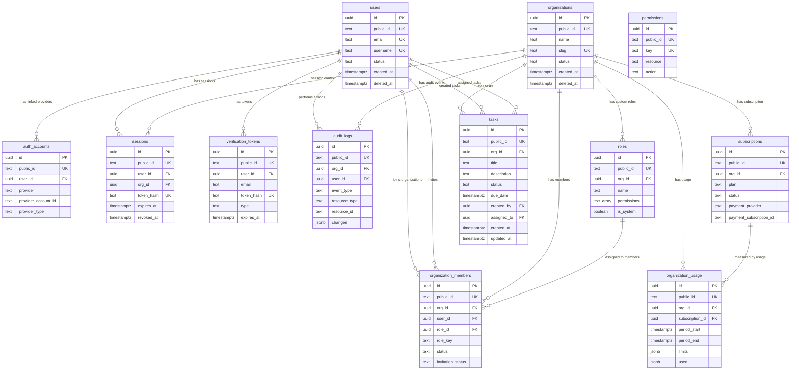
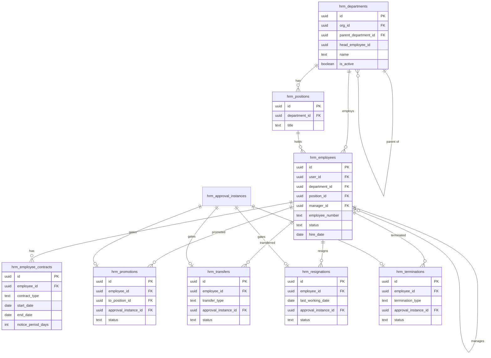
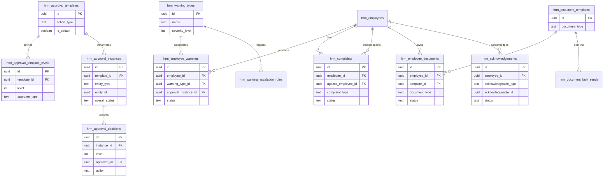
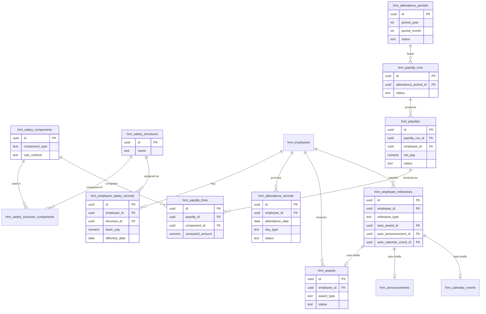

# Entity Relationship Diagram

## High-level relationship flow

```text
users
  ├── auth_accounts
  ├── sessions
  ├── verification_tokens
  ├── organization_members
  └── audit_logs

organizations
  ├── organization_members
  ├── roles
  ├── sessions
  ├── subscriptions
  ├── organization_usage
  └── audit_logs

roles
  └── organization_members

subscriptions
  └── organization_usage

organizations
  └── tasks

tasks
  ├── users (created_by)
  └── users (assigned_to)
```

## Mermaid ERD



## Important modeling notes

`permissions` does not currently have a physical many-to-many join table with `roles`. The `roles.permissions` field stores permission keys as `TEXT[]`. This is acceptable for an early SaaS phase because it keeps RBAC simple, but the application must validate all role permission keys against `permissions.key`.

For a larger enterprise-grade version, add a normalized `role_permissions` table.

---

## HRM (added r9)

40 tables — too many to put in one readable Mermaid diagram with full column lists (that level of detail lives in `data-dictionary.md`). Split by group instead, showing entities and relationships only. Every HRM table also has `organizations ||--o{ <table>` for tenant scoping, omitted below for readability.

### High-level relationship flow

```text
hrm_departments
  ├── hrm_positions
  ├── hrm_employees (department_id)
  └── hrm_departments (parent_department_id, self-referencing)

hrm_employees
  ├── hrm_leave_requests
  ├── hrm_employee_salary_records
  ├── hrm_employee_contracts
  ├── hrm_promotions / hrm_transfers / hrm_resignations / hrm_terminations
  ├── hrm_employee_warnings
  ├── hrm_complaints (as complainant, and optionally as against_employee_id)
  ├── hrm_employee_documents
  ├── hrm_acknowledgements
  ├── hrm_attendance_records
  ├── hrm_payslips
  ├── hrm_awards
  └── hrm_employee_milestones

hrm_approval_templates
  ├── hrm_approval_template_levels
  └── hrm_approval_instances
        └── hrm_approval_decisions

hrm_approval_instances (polymorphic entity_type/entity_id, no FK)
  ← referenced by: hrm_promotions, hrm_transfers, hrm_resignations,
    hrm_terminations, hrm_employee_warnings, hrm_awards,
    hrm_attendance_records (regularization)

hrm_salary_components
  └── hrm_salary_structures (via hrm_salary_structure_components)
        ├── hrm_employee_salary_records
        └── hrm_payslips

hrm_attendance_periods
  ├── hrm_attendance_records (by date range, no direct FK)
  └── hrm_payslip_runs (optional link)

hrm_payslip_runs
  └── hrm_payslips
        └── hrm_payslip_lines

hrm_holiday_calendars
  ├── hrm_holidays
  └── hrm_calendar_assignments

hrm_document_templates
  ├── hrm_employee_documents
  └── hrm_document_bulk_sends

hrm_employee_milestones
  ├── hrm_awards (auto_award_id)
  ├── hrm_announcements (auto_announcement_id)
  └── hrm_calendar_events (auto_calendar_event_id)

hrm_acknowledgements (polymorphic acknowledgeable_type/acknowledgeable_id, no FK)
  ← referenced by: hrm_employee_warnings (via type), hrm_employee_documents,
    hrm_announcements, hrm_calendar_events
```

### Mermaid ERD — org structure & lifecycle (Groups A core + B)



### Mermaid ERD — approval chains, disciplinary & documents (Group C + approval engine)



### Mermaid ERD — time, compensation & recognition (Groups D + E)



### Notes specific to HRM's modeling

- **Polymorphic tables have no physical FK** for their target — `hrm_approval_instances.entity_id`, `hrm_acknowledgements.acknowledgeable_id`, `hrm_employee_documents.related_id`, and the `assignee_id` columns in `hrm_work_schedule_assignments`/`hrm_calendar_assignments` all rely on application-level integrity, matched against a sibling `_type` column. Same trade-off as `roles.permissions` above — simpler schema, but the application must validate consistency.
- **Snapshot columns are intentional duplication, not denormalization debt.** Several tables (e.g. `hrm_payslip_lines.component_name`, `hrm_employee_warnings.warning_type_name`, `hrm_promotions.from_basic_pay`) copy a value at write time specifically so that later edits to the source record don't rewrite history. Don't "clean these up" — removing them would let editing a salary component retroactively change what a historical payslip claims it paid.
- **Two tables named `..._assignments` exist for unrelated things:** `hrm_work_schedule_assignments` (which shift an employee/dept/org uses) and `hrm_calendar_assignments` (which holiday calendar an employee/dept/org uses). Both use the same `assignee_type`/`assignee_id` polymorphic pattern but are otherwise independent.
