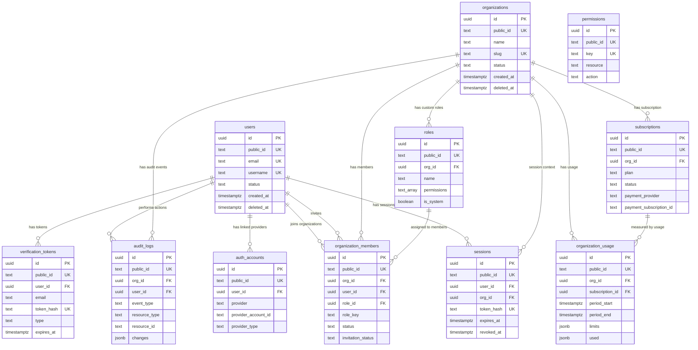

# Entity Relationship Diagram

## High-level relationship flow

```text
users
  ├── auth_accounts
  ├── sessions
  ├── verification_tokens
  ├── organization_members
  └── audit_logs

organizations
  ├── organization_members
  ├── roles
  ├── sessions
  ├── subscriptions
  ├── organization_usage
  └── audit_logs

roles
  └── organization_members

subscriptions
  └── organization_usage
```

## Mermaid ERD



## Important modeling notes

`permissions` does not currently have a physical many-to-many join table with `roles`. The `roles.permissions` field stores permission keys as `TEXT[]`. This is acceptable for an early SaaS phase because it keeps RBAC simple, but the application must validate all role permission keys against `permissions.key`.

For a larger enterprise-grade version, add a normalized `role_permissions` table.
